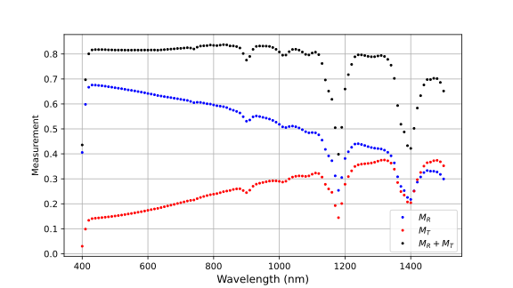
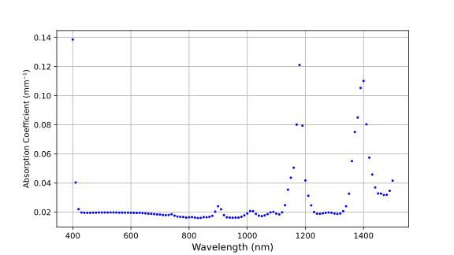
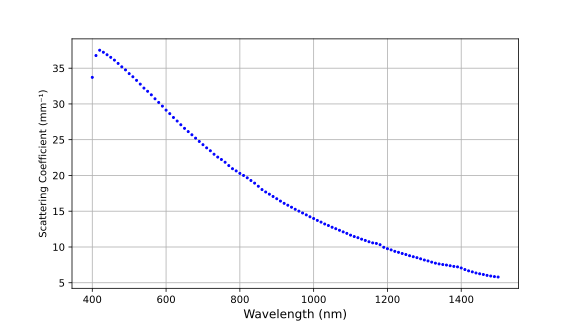

Inverse Adding-Doubling
=======================

.. image:: https://img.shields.io/github/v/tag/scottprahl/iad?label=latest
   :alt: GitHub tag (latest by date)

.. image:: https://img.shields.io/badge/MIT-license-yellow.svg
   :alt: MIT License
   :target: https://github.com/scottprahl/iad/blob/main/License

.. image:: https://github.com/scottprahl/iad/actions/workflows/make.yml/badge.svg
   :alt: GitHub Actions
   :target: https://github.com/scottprahl/iad/actions/workflows/make.yml

.. image:: https://zenodo.org/badge/102147394.svg
   :alt: DOI
   :target: https://zenodo.org/badge/latestdoi/102147394

``iad`` estimates intrinsic optical properties from integrating-sphere reflection
and transmission measurements. ``ad`` performs the corresponding forward
adding-doubling calculation.

Overview
--------

Inverse Adding-Doubling determines the optical properties of flat, layered,
scattering and absorbing samples from measurements of total reflection and
transmission. It repeatedly guesses the sample properties, runs a forward
adding-doubling calculation, and adjusts the guess until the calculated and
measured values agree.

The repository builds two main command-line programs:

``ad``
    Forward adding-doubling. Given albedo, optical thickness, and anisotropy, it
    returns total reflection and transmission.

``iad``
    Inverse adding-doubling. Given measured reflection and transmission, sample
    thickness, boundary conditions, and optional integrating-sphere geometry, it
    estimates absorption coefficient ``mu_a``, reduced scattering coefficient
    ``mu_s'``, and anisotropy ``g``.

The method follows `Prahl et al., Applied Optics, 32, 559-568, 1993
<https://omlc.org/~prahl/pubs/pdfx/prahl93a.pdf>`_ and van de Hulst's
`Multiple Light Scattering <https://www.amazon.com/Multiple-Light-Scattering-Formulas-Applications-ebook/dp/B01D4CMF80>`_.
This implementation includes Fresnel boundary reflections and corrections for
integrating-sphere measurements. Because a one-dimensional adding-doubling model
cannot account for light that exits the sample edges, ``iad`` also embeds a
Monte Carlo estimate for lost light.

The full user documentation is in the `manual <docs/manual.pdf>`_.

Build
-----

On Linux or macOS, build the command-line programs from the repository root:

.. code-block:: bash

    make

This creates ``./ad`` and ``./iad``. To install them under ``/usr/local/bin``:

.. code-block:: bash

    sudo make install

See `INSTALL.md <INSTALL.md>`_ for more installation notes. Windows binaries are
available from the `GitHub releases
<https://github.com/scottprahl/iad/releases>`_ page as ``iad-win`` archives.

The original source is written in CWEB ``.w`` files. The generated ``.c`` and
``.h`` files are included in the repository, so CWEB is not required for a
normal build from a release archive or checkout.

Test
----

Run the quick command-line regression tests with:

.. code-block:: bash

    make shorttest

For a smaller CI-style smoke test:

.. code-block:: bash

    make veryshorttest

For the larger batch test suite:

.. code-block:: bash

    make longtest

Usage
-----

Invert a single measurement
~~~~~~~~~~~~~~~~~~~~~~~~~~~

To estimate the optical properties of a 1 mm thick sample with 40% total
reflectance and 10% total transmission:

.. code-block:: bash

    ./iad -r 0.4 -t 0.1 -d 1

The output ends with a table like this:

.. code-block:: text

    #       Measured   M_R     Measured   M_T    Estimated Estimated Estimated
    ##wave     M_R     fit        M_T     fit       mu_a     mu_s'       g
    # [nm]    [---]    [---]     [---]    [---]     1/mm     1/mm      [---]
         1   0.4000   0.4000    0.1000   0.0999    0.4673   3.9317    0.0000    *

The ``*`` marks a successful fit for that row.

Run the matching forward calculation
~~~~~~~~~~~~~~~~~~~~~~~~~~~~~~~~~~~~

Use ``-z`` to run ``iad`` in forward-calculation mode. Here ``-A`` sets the
absorption coefficient, ``-j`` sets the reduced scattering coefficient, and
``-d`` sets the sample thickness:

.. code-block:: bash

    ./iad -z -A 0.4673 -j 3.9317 -d 1

The output ends with:

.. code-block:: text

    #       Measured    M_R    Measured    M_T    Estimated Estimated Estimated
    ##wave     M_R      fit       M_T      fit      mu_a      mu_s'       g
    # [nm]    [---]    [---]     [---]    [---]     1/mm      1/mm      [---]
         0   0.0000   0.4000    0.0000   0.0999    0.4673    3.9317     0.0000    *

Analyze spectral data
~~~~~~~~~~~~~~~~~~~~~

Spectral measurements are usually stored in ``.rxt`` files. Each file contains
an experiment header followed by wavelength-dependent reflection and
transmission measurements. For example,
`phantom_with_no_slides.rxt <docs/phantom_with_no_slides.rxt>`_ contains data
from a spectrophotometer equipped with a dual-beam integrating sphere.

Process the file with:

.. code-block:: bash

    ./iad -X -i 8 -g 0.9 docs/phantom_with_no_slides.rxt

Here ``-X`` selects the dual-beam sphere correction, ``-i 8`` sets the angle of
incidence to 8 degrees, and ``-g 0.9`` sets the default scattering anisotropy.
In this example, the refractive index of the PDMS sample changes with each data
point.

The resulting absorption spectrum matches the intrinsic absorption of Wacker
PDMS reported in Cai's 2008 `dissertation
<https://dx.doi.org/10.17877/DE290R-8242>`_.

The scattering estimate is nearly independent of the absorption coefficient for
this data set.

Python notebook helper
~~~~~~~~~~~~~~~~~~~~~~

``iadplus`` is a Python command-line helper that runs ``iad`` on an ``.rxt`` file,
plots the results, and assembles the output into a Jupyter notebook.

.. code-block:: bash

    ./iadplus -options '-i 8 -X' file.rxt

This creates ``file-notebook/file.ipynb`` plus the ``.svg`` plots used by the
notebook. The companion ``iadsum`` script summarizes results from multiple
``iad`` output files.

License
-------

This project is distributed under the MIT license. See the `license file
<License>`_.

Author
------

Scott Prahl

http://omlc.org/~prahl
